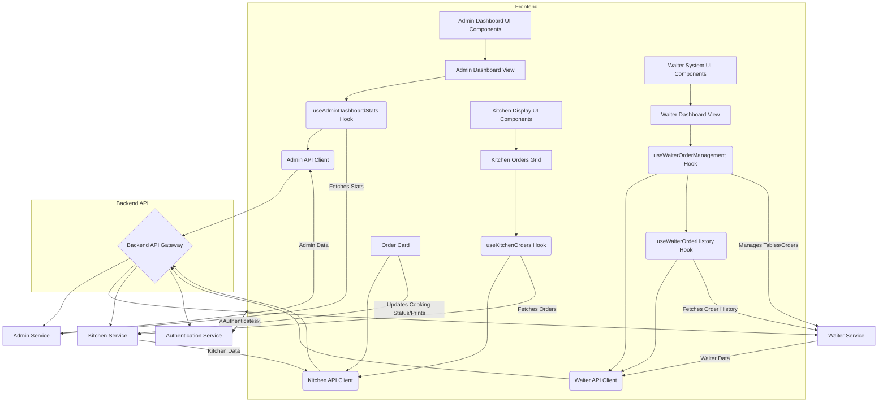

```markdown
# System Architecture Document

## 1. Introduction

This document outlines the architecture of the [System Name - Placeholder]. The system is designed to manage restaurant operations, encompassing aspects like order taking, kitchen display, waiter management, and administrative oversight. This document synthesizes information from various sub-agent reports to provide a comprehensive overview of the system's structure, modules, and data flow.

## 2. Tech Stack

Based on the provided agent reports, the following technologies are inferred to be part of the system's tech stack:

*   **Frontend Framework:** React (inferred from `.tsx` file extensions and component-based architecture).
*   **State Management/Data Fetching:** React Query (`@tanstack/react-query`) for efficient data fetching and caching, `useState` and custom hooks for local and component-level state.
*   **API Communication:** Axios (`@/utils/axiosInstance`) for making HTTP requests.
*   **UI Styling:** Tailwind CSS (inferred from `grid gap-6 grid-cols-1 sm:grid-cols-2 lg:grid-cols-3` and `hsl(var(--chart-1))` usage).
*   **TypeScript:** Used for type safety and defining data structures.
*   **Backend (Inferred):** A RESTful API is being consumed by the frontend, with specific routes for admin, waiter, and kitchen functionalities.

## 3. Module Details

This section details the identified modules within the system, synthesizing the information from the agent reports.

### 3.1. Admin Dashboard

The Admin Dashboard module provides an overview of key restaurant metrics for administrative users.

*   **Key Files:**
    *   `AdminDashboardView.tsx`: Handles client-side rendering, UI logic, and state management for the dashboard.
    *   `api.ts`: Contains API interaction logic for fetching dashboard statistics.
*   **Logic Flows:**
    1.  **Data Fetching:** The `useAdminDashboardStats` hook initiates data fetching by calling `fetchAdminDashboardStats` from `api.ts`.
    2.  **State Management:** The hook manages loading states and dashboard statistics, including filter updates.
    3.  **UI Rendering:** `AdminDashboardView.tsx` conditionally renders stat cards, chart cards, and a table of latest orders based on fetched data.
*   **UI Components:**
    *   `AdminDashboardView`: Main dashboard layout.
    *   `DashboardStatCard`: Displays individual statistics (e.g., Total Sales).
    *   `DashboardChartCard`: Renders charts (e.g., Sales Over Time, Top Categories).
    *   `LatestOrdersTable`: Displays recent orders.
*   **Data Interactions:**
    *   Fetches data from `API_ROUTES.ADMIN.DASHBOARD.STATS`.
    *   Expects `AdminDashboardStats` structure including sales, orders, categories, waiters, sales over time, top categories, and latest orders.

### 3.2. Waiter System

The Waiter System module facilitates order management and table status for restaurant staff.

*   **Key Files:**
    *   `WaiterDashboardView.tsx`: Main UI for waiters, displaying tables and handling order interactions.
    *   `useWaiterOrderManagement.ts`: Hook for managing table and order data, including fetching and performing operations.
    *   `api.ts`: API client functions for waiter-specific data retrieval.
    *   `useWaiterOrderHistory.ts`: Hook for fetching waiter order history.
*   **Logic Flows:**
    1.  **Data Fetching:** `useWaiterOrderManagement` fetches tables and occupied tables using `useQuery`.
    2.  **Dashboard Rendering:** `WaiterDashboardView.tsx` displays tables and their occupancy status.
    3.  **Order Operations:** The hook provides functions for creating/updating orders, processing payments, and moving orders between tables.
    4.  **Order History:** `useWaiterOrderHistory` fetches historical order data.
*   **UI Components:**
    *   `WaiterDashboardView`: Renders a list of `Table` components.
    *   `Table`: Represents an individual table with status and interaction callbacks.
*   **Data Interactions:**
    *   Fetches tables and occupied tables via API calls.
    *   Performs mutations for order creation, payment processing, and order movement.
    *   Fetches order history.

### 3.3. Kitchen Display

The Kitchen Display module provides a real-time view of orders for the kitchen staff.

*   **Key Files:**
    *   `src/features/kitchen/api.ts`: API functions for updating cooking status and printing order items.
    *   `src/features/kitchen/components/KitchenOrdersGrid.tsx`: Main UI component for displaying orders in a grid.
    *   `src/features/kitchen/components/OrderCard.tsx`: Component for an individual order, handling status toggles and printing.
    *   `src/features/kitchen/types.ts`: Defines TypeScript interfaces for kitchen orders and items.
    *   `src/features/kitchen/hooks/useKitchenOrders.ts`: Custom hook for fetching kitchen orders.
    *   `src/app/kitchen/page.tsx`: The main kitchen dashboard page.
*   **Logic Flows:**
    1.  **Order Display:** `KitchenOrdersGrid` fetches orders via `useKitchenOrders` and renders `OrderCard` components.
    2.  **Cooking Status Toggle:** User interaction triggers `handleToggleCooking`, which calls `toggleCookingStatus` API and updates local UI state.
    3.  **Printing Kitchen Items:** `handlePrintKitchenItems` calls the `printKitchenItems` API.
    4.  **Data Fetching/Refetching:** `useKitchenOrders` handles initial fetch; `refetch` can be used to refresh data.
*   **UI Components:**
    *   `KitchenOrdersGrid`: Grid layout for orders.
    *   `OrderCard`: Displays individual order details and interactive elements.
*   **Data Interactions:**
    *   Fetches orders from `API_ROUTES.KITCHEN.GET_ORDERS`.
    *   Updates cooking status via `toggleCookingStatus` API.
    *   Initiates printing via `printKitchenItems` API.
    *   Utilizes `KitchenOrder` and `KitchenOrderItem` data structures.

### 3.4. Authentication (Not Detailed)

The Authentication module's specifics were not detailed in the provided reports. It is assumed to handle user login, session management, and authorization, likely interacting with a backend authentication service.

## 4. Data Flow

The system operates with a client-server architecture where the frontend applications (Admin Dashboard, Waiter System, Kitchen Display) interact with a backend API.

*   **Admin Dashboard:** Fetches aggregated sales and operational data from the backend to provide a high-level overview. This data is then rendered into various statistical cards and charts.
*   **Waiter System:** Interacts with the backend to retrieve table statuses, current orders, and available menu items. Waiters can create, update, and process payments for orders, with these actions being sent as mutations to the backend. Order history is also fetched for review.
*   **Kitchen Display:** Continuously fetches active orders from the backend. Kitchen staff can update the cooking status of items, and this change is communicated back to the backend. Printing requests for order items are also handled via API calls.

Data flows from the backend API to the respective frontend modules, where it is processed, managed by hooks (like React Query), and rendered into user interfaces. User interactions on the frontend trigger API calls (queries or mutations) to update the backend state or retrieve new information.

## 5. System Diagram


```